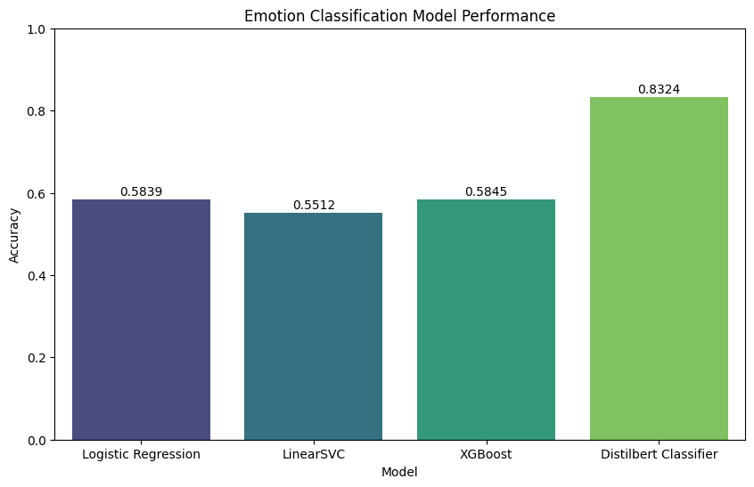
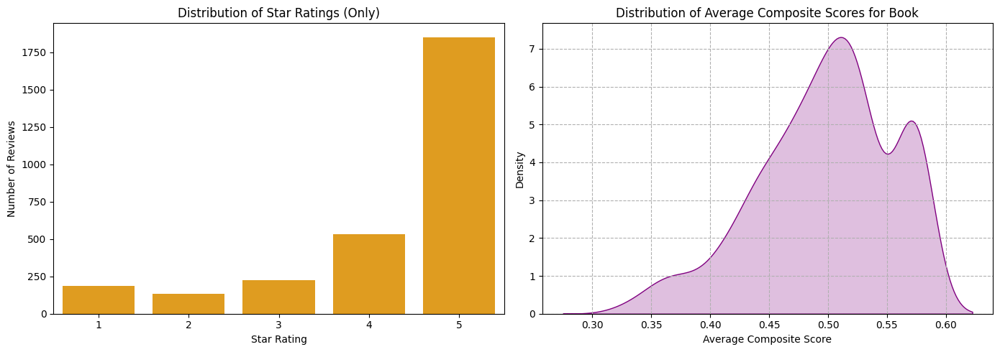

# Amazon Book Recommendation System: Combining Ratings & Review Emotions

An NLP-based book ranking framework that combines numerical star ratings with emotions extracted from review text to produce more nuanced, less biased recommendations, benchmarking classical ML against a transformer to get there.

Built by Phan Thao Van.

## Key results

- Trained and compared **Logistic Regression, Linear SVM, XGBoost, and DistilBERT** for emotion classification on review text.
- **DistilBERT achieved 83.24% accuracy**, substantially outperforming the TF-IDF-based traditional models (all under 60%) — clear evidence that contextual embeddings matter for the nuanced, often sarcastic language of book reviews.
- Integrated review **sentiment, emotion, star rating, and helpfulness** signals into a single composite book-ranking score.
- Validated the system with **hypothesis testing, correlation analysis, sensitivity analysis, and rank-displacement metrics** rather than eyeballing the output.
- Processed a **reproducible 10,000-review sample drawn from an original 3M-review Amazon Books dataset**, integrated with book metadata and a fine-grained emotion taxonomy (GoEmotions).

| Model | Type | Accuracy |
|---|---|---|
| Logistic Regression | Classical ML (TF-IDF) | 58.39% |
| Linear SVM | Classical ML (TF-IDF) | 55.12% |
| XGBoost | Classical ML (TF-IDF) | 58.45% |
| **DistilBERT** | Transformer | **83.24%** |



## The problem

Star ratings are noisy and skewed — in this dataset, roughly 61% of reviews are 5 stars, which flattens the signal sellers and platforms actually need. This project tests whether the emotional content of the review *text* (admiration, disapproval, disappointment) carries information the numeric score throws away, and whether blending the two produces a meaningfully different (and better) book ranking.

## Approach

1. **Data sourcing**: evaluated 6 candidate datasets before settling on a combined review + metadata dataset; sampled 10,000 reviews from an original 3M-row Amazon Books Reviews dataset (fixed random seed for reproducibility).
2. **Cleaning & feature engineering**: missing-value handling, minimum-review thresholds per book, text normalization, and a derived helpfulness-ratio feature (`src/preprocessing.py`).
3. **Statistical analysis**: Mann-Whitney U tests and Pearson/Spearman correlation to establish, before any modeling, that review sentiment predicts helpfulness independently of star rating (`src/evaluation.py`).
4. **Emotion classification**: four approaches benchmarked head-to-head on the same train/test split: TF-IDF + Logistic Regression/SVM/XGBoost vs. a fine-tuned DistilBERT transformer (`src/emotion_classifier.py`).
5. **Recommendation-system design**: a composite score blending percentile-ranked star ratings (40%) and DistilBERT emotion scores (60%), aggregated to a per-book ranking (`src/ranking.py`).
6. **Evaluation & sensitivity analysis**: Spearman rank correlation, mean absolute rank displacement, and tie-breaking rate to quantify how much the composite score actually changes the leaderboard versus star ratings alone; weighting choice (0.4/0.6) validated against alternative splits.

## Results in detail

Applying the composite score to the full book set:

- **High correlation, high reordering:** Spearman correlation of **0.954** with the original star-rating ranking, yet **99.27% of books changed rank**, with a mean absolute rank shift of **32.77 positions** — the composite score agrees with star ratings in aggregate while meaningfully re-ordering individual books based on emotional signal.
- **Bias correction:** transformed a heavily right-skewed rating distribution into a more balanced, bell-shaped one, creating clearer separation between "good" and "outstanding" books.
- **Broke 85.06% of star-rating ties**, giving the ranking meaningfully finer granularity than the 5-point scale alone can offer.



## Tech stack

`Python` · `pandas` · `scikit-learn` · `XGBoost` · `Hugging Face Transformers` (DistilBERT) · `NLTK` (VADER) · `scipy` (Mann-Whitney U, Spearman correlation) · `matplotlib` / `seaborn` / `WordCloud` · `KaggleHub`

## Repository structure

```text
amazon-book-recommendation-nlp/
│
├── README.md
├── requirements.txt
├── .gitignore
│
├── notebooks/
│   └── amazon_book_recommendation.ipynb   # full end-to-end analysis with commentary
│
├── src/
│   ├── preprocessing.py       # cleaning, feature engineering, dataset integration
│   ├── emotion_classifier.py  # 4-model training & comparison (incl. DistilBERT)
│   ├── ranking.py             # composite score + book-level aggregation
│   └── evaluation.py          # hypothesis testing & ranking-comparison metrics
│
├── data/
│   └── README.md              # links to source datasets (not checked in — 3M rows)
│
├── results/
│   ├── model_comparison.png
│   ├── ranking_comparison.png
│   └── correlation_heatmap.png
│
└── LICENSE
```

`src/` mirrors the notebook's logic as importable, reusable functions; the notebook itself remains the full narrative walkthrough with visualizations and interpretation at each step.

## Data sources

- [Amazon Books Reviews](https://www.kaggle.com/datasets/mohamedbakhet/amazon-books-reviews) (Kaggle)
- [GoEmotions](https://github.com/google-research/google-research/tree/master/goemotions) (Google Research) — 28-category emotion taxonomy used to train the classical classifiers
- Supporting book-metadata dataset (see `data/README.md` and the notebook's data-sourcing section)

## Ethics & limitations

Emotion labeling from text is inherently subjective, and flattening multi-label emotions into a single label for training simplifies real reader sentiment. The datasets used are publicly available and analyzed only in aggregate; the notebook includes a dedicated discussion of data ethics, privacy, and the limitations of the approach in its final sections.
